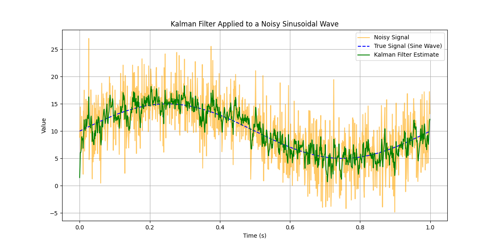

`Ярощук Александр Михайлович ИПЗ 4.04`
# FilterKalmana

# Стандартные значение



# Q = 10


# Q = 0.01


```Как мы видим повышение параметра Q ухудшает фильтрацию, а уменьшение наоборот повышает.```

# R = 100


# R = 1000


```Как мы видим чем больше повышаем параметр R, тем быстрее измеряется шум и тем эффективней фильтрация.```

# P = 10


# x = 10


`Указав начальную точку для фильрации x = 10, фильтрация начнется с самого начала.`

# offset = 30


`изменив offset, мы изменяем положениме сигнала по Y.`

# total_time = 2


`Когда мы изменяем время вычисление волна сигнала просто изменяется, если поставим 2 то сигнал просто повторится 2 раза.`

# Лучшие параметры для фильтрации

```
frequency = 2
noise_variance = 64
R = 1000
x = 10
```


`Когда мы ставим такие параметры как: `

`R = 1000`

`x = 10`

`То фильрация выглядит максимально эффективно`


